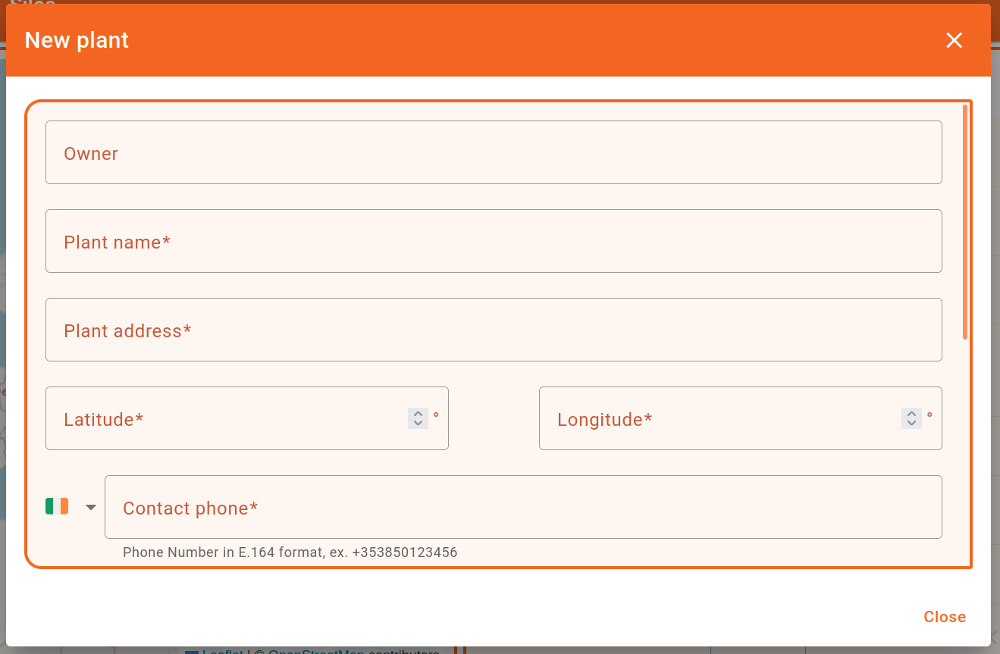
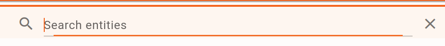
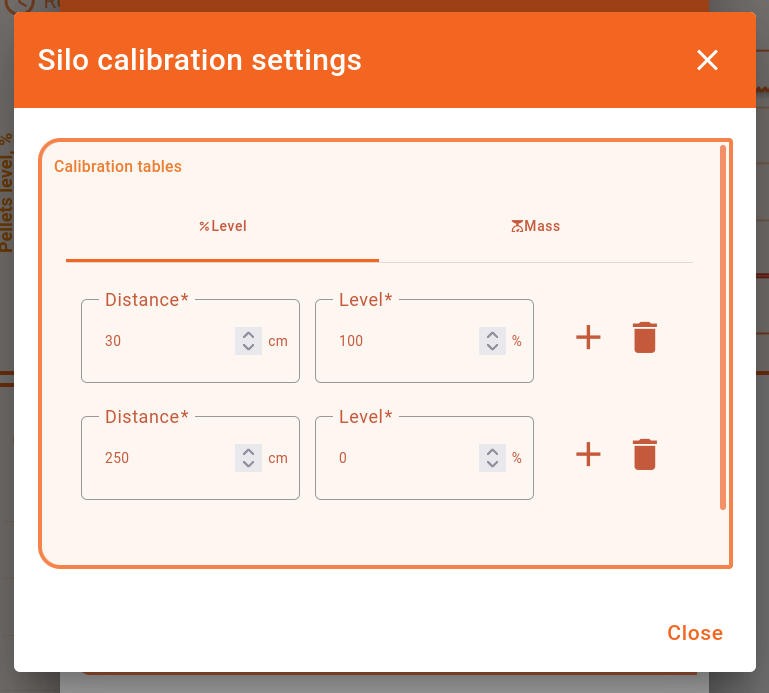

# План работ по проекту Flutter Sensors
nn| Описание | К-во часов
-|-|-
1| Реализация окон (визуальная часть)|153
1.1| Main Page | 62
-| Гугл карта с метками| 25
-| [Таблица справа](#user-content-таблица-справа) | 37
1.2| [Account Window](#user-content-account-window) | 18
1.3| [Details Window](#user-content-details-window) | 73
-|[Виджет текущего состояния](#user-content-виджет-текущего-состояния)|16
-|[График истории](#user-content-график-истории)|29
-|[Consumption](#user-content-consumption)|8
-|[Таблица истории](#user-content-таблица-истории)|8
-|[General Settings Window](#user-content-general-settings-window)|12
2| Подключение к источнику данных
-|  создание тестового аккаунта
-|  запрос данных при отображении
-|  сохранение данных при изменениях
3 | остальное
-| тестирование
-| публикация в Google Play

## Анализ web-версии проекта

## 1. Общее

Описание | К-во часов
-|-
навигация| 2

## 2. Main Page

https://fuelowl.engix.ie/dashboard/3f1f49e0-51e1-11ed-86fe-9dcd4c516023

Описание | К-во часов
-|-
*App bar*|2
-навигация
-кнопка Назад,
-кнопка Домой
-кнопка Logout
-Contact Us (mailto:support@woodco-energy.com)
-Account [Account Window](#user-content-account-window)
*плавающий логотип внизу*|1

*Гугл карта с метками*

поиск и выбор виджета|2
рисование|2
подключение к источнику данных|2
общая логика|1
тестирование|1
pan, zoom | 1
full screen | 1
обновление таблицы при pan/zoom | 2
*Сlick Baloon - Show Plant Information*

рисование|2
подключение к источнику данных (чтение, сохранение)|2
тестирование|1
*Baloon Popup*

рисование|2
подключение к источнику данных (чтение, сохранение)|2
тестирование|1
**Всего** | 25

### Таблица справа

Описание | К-во часов
-|-
поиск и выбор виджета|2
рисование таблицы| 2
подключение к источнику данных|2
общая логика|1
тестирование|1
сортировка|1
paging|1
scrolling|1
*окно Add Owner*

рисование|2
подключение к источнику данных (чтение, сохранение)|2
*окно Add Plant*

рисование|2
подключение к источнику данных (чтение, сохранение)|2
*окно Add Silo*

рисование|2
подключение к источнику данных (чтение, сохранение)|2
*Search Box*

рисование|1
подключение к источнику данных (чтение)|1
*click details icon - Show Plant Information*|1

*Gate Token Wnd*|2

*Edit Plant Info*

рисование|2
подключение к источнику данных (чтение)|2
*Delete Plant Btn*
*Delete Silo*
*кастомные виджеты состояния (отрисовка)*
Online|1
Level, %|1
Mass, t|1
Owner (3 rows)|1
*кастомные виджеты состояния (подкл. к данным)*|2
*click row - open Details Window*
[Details Window](#user-content-details-window)
**Всего** | 37

## Account Window
Описание | К-во часов
-|-
*Profile*

рисование|2
подключение к данным|2
*Security*

рисование|2
подключение к данным|2
*Notification Settings*

рисование|2
подключение к данным|2
*Режим полного экрана*|1
*Инфа о текущем пользователе в AppBar*|1

*Окно уведомлений*

рисование|2
подключение к данным|2
**Всего** | 18

## Details Window

### Виджет текущего состояния

Описание | К-во часов
-|-
рисование|2
подключение к данным|2
кнопка Show More Information изменяет отображение текущего виджета|1
кнопка General Settings открывает окно [General Settings Window](#user-content-general-settings-window)|1
*кастомные иконки с данными*
рисование
LoRa|0.5
Battery|0.5
Env.Temp|0.5
Env.Humidity|0.5
Latest Data Timestamp|0.5
Signal Quality|0.5
WiFi|0.5
Angle.Y|0.5
Angle.X|0.5
Cleaning Cycles|0.5
Received Packages|0.5
подключение к данным|2
**Всего** | 16

### График истории

Описание | К-во часов
-|-
поиск и выбор виджета|2
всплывающая метка|2

выделение и zoom|2
кнопка настроек Edit timewindow|1

-открывает окно  Edit timewindow
*Realtime (окно настроек)*

рисование|2
подключение к данным|2
-возможность задать интервал

-вкладка History

рисование|2
подключение к данным|2
-установка дат интервала через календарь|2

-установка времени интервала через часы|2

-при нажатии на иконку E отображается *окно с табличными данными истории*

рисование|2
подключение к данным|2
-scrolling
-paging
*кнопка Distance Chart отображает окно Distance Chart*

рисование|2
подключение к данным|2
-кнопка расширения на весь экран для любого из графиков|1
**Всего** | 29

### Consumption
Описание | К-во часов
-|-

рисование|2
подключение к данным|2
кнопка настроек отображает окно Estimation Period Settings

рисование|2
подключение к данным|2
**Всего** | 8

### Таблица истории
Описание | К-во часов
-|-

рисование|2
подключение к данным|2
-scrolling
-paging
кнопка Edit timewindow аналогично кнопке на графике, но с дополнениями

рисование|2
подключение к данным|2
**Всего** | 8

## General Settings Window
Описание | К-во часов
-|-
-scrollable

рисование|2
подключение к данным|2

рисование|2
подключение к данным|2

рисование|2
подключение к данным|2
*Silo calibration settings - level*

*Silo calibration settings - mass*

рисование|2
подключение к данным|2
*Silo Alarm Settings*

рисование|2
подключение к данным|2
*Sensor Settings*

рисование|2
подключение к данным|2
**Всего** | 12
